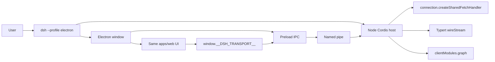

# Electron desktop application

## What already exists

DeepSeek Harness already reserved this surface and left the seams:

- Host/client split is capability-based, not product-based. A new app is assembly under `apps/`, not an `electron-*` UI family ([archived layering note](.agents/notes/archived/architecture/2026-07-19-gui-layering-and-rpc-protocol.md)).
- Browser transport is HTTP + WebSocket. Any other shell installs `window.__DSH_TRANSPORT__` (`fetch`, `openStream`, `loadBundle`, `ownsHost`) before `AppWebEntry.run()` — the experimental [webworker page glue](packages/experimental/webworker-runtime/src/client/index.ts) is the working template.
- Host RPC is already transport-independent: `connection.createSharedFetchHandler('/api')` plus Typert `wireStream.open`.
- Application launch stays `dsh --profile <name>` only ([architecture](docs/architecture.md#application-launch)). Electron is not a second public Node bin.

Today `dsh-client-connection` and `dsh-client-modules` both `inject` `webServer` and register HTTP routes. Electron must not bind that server. That is the only prerequisite change.



## Process topology

Keep the harness on **system Node**, not Electron's Node ABI.

- Source: `dsh --profile electron` boots the host, then spawns `electron` from the workspace, passing a one-shot IPC socket path.
- Packaged: the installer exe is Electron. It immediately execs the bundled `dsh --profile electron` (same profile, same host). Native addons (`node-pty`, koffi, ripgrep, Landlock) stay on the Node they were built for — no `@electron/rebuild`.

Rejected: running the full host inside Electron main (ABI rebuild across every native addon). Rejected: loading `http://127.0.0.1:3080` in a BrowserWindow (contradicts [webserver](packages/host/webserver/README.md) and the archived layering note).

Privilege: the renderer is sandboxed (`contextIsolation`, no `nodeIntegration`). Preload exposes only the transport hooks. The host accepts IPC only from the child it spawned (Windows named pipe with a restricted ACL). Set `ownsHost: true` so cookie/token/Host-Origin checks stay HTTP-only.

## Stack (three PRs)

Repo policy is split independent changes. Implement as a native GitHub stack.

### PR 1 — Host works without a listening webserver

Make HTTP registration optional so a tree can activate Connection and client-modules with zero ports.

- [`packages/client/connection/src/index.ts`](packages/client/connection/src/index.ts): drop hard `inject: ['webServer']`. Always provide `HostConnectionService` + `createSharedFetchHandler`. Register the `/api` HTTP route only when `ctx.get('webServer')` exists.
- [`packages/client/modules/src/index.ts`](packages/client/modules/src/index.ts): same for `/plugins` and `webserver/index-inject`. Keep `graph()` and bundle bytes readable without HTTP (the Electron shell will pull them over IPC).
- Tests: existing web suites stay green; add one Loader tree that mounts connection + modules **without** webserver and drives unary RPC + `graph()` in-process.

### PR 2 — Official `electron` profile and window

New composition, no new UI packages.

- Template in [`packages/boot/app-boot/src/profile.ts`](packages/boot/app-boot/src/profile.ts):

```ts
electron: {
  bundles: ['@deepseek-ai/dsh-base', '@deepseek-ai/dsh-electron-app'],
  patchReload: 'startup',
}
```

- [`packages/bundle/electron-app/`](packages/bundle/electron-app/): patch clones the web roster (session/workspace controllers, browser plugins, directory-picker-auto) and **omits** `webserver`, `frontend-static`, `web-startup` host/port flags, and browser handoff. Glue plugin: resolve `apps/web` dist, mint the IPC socket, spawn Electron, dispose the tree when the last window closes. Prompt section orients the model to the desktop app (no `DSH_WEB_URL`).
- [`apps/electron/`](apps/electron/): main / preload / thin renderer entry. Main loads dist over a custom privileged protocol (not raw `file://` — module maps and plugin URLs stay same-origin). Preload installs `__DSH_TRANSPORT__` and applies the same index-injection table the worker preview uses (`__ModuleLoader__`, combo scripts, `__DSH_BOOT__`, `__DSH_BOOT_READY__`). Reuse [`apps/web/src/main.ts`](apps/web/src/main.ts) / `AppWebEntry`.
- IPC frames can copy the worker tunnel (`req` / `res` / stream open-item-end) from [`packages/experimental/webworker-runtime/src/transport/frames.ts`](packages/experimental/webworker-runtime/src/transport/frames.ts) without importing the experimental package (release apps must not depend on `packages/experimental/*`).
- Launcher: optional `dsh electron` alias beside `dsh web` in [`apps/cli/src/args.ts`](apps/cli/src/args.ts). Classify Electron sources in [`scripts/verify-application-entrypoints.ts`](scripts/verify-application-entrypoints.ts) as the profile-owned window shell, not a new Node application bin.
- Docs: [`docs/architecture.md`](docs/architecture.md) shipped-application list, [`packages/bundle/README.md`](packages/bundle/README.md), bilingual package README, user-facing page under `docs/user/`. Agent Note at `.agents/notes/implemented/architecture/2026-09-02-electron-desktop-profile.md` (English + Chinese + sidecar).

**Verification for PR 2**

- Bundle Loader smoke: tree settles, no listen port, `createSharedFetchHandler` answers one unary call.
- Keyless Electron smoke: spawn the profile, wait for window, assert conversation chrome (reuse web ARIA selectors).
- One recorded-session snapshot under `snapshots/electron/` (or a web fixture replayed through the electron profile) so the desktop surface is gated like web.
- `pnpm run test` on the new packages, plus the focused composition/e2e above. Do not run the full suite unless something repository-wide broke.

### PR 3 — Windows x64 installer

- `electron-builder` NSIS target, win-x64 only (matches the existing Python runtime's Windows target; macOS/Linux installers later).
- Payload: Electron shell + a hoisted Node closure of `@deepseek-ai/dsh` (same deploy idea as [`scripts/build-exe-for-python-sdk.ts`](scripts/build-exe-for-python-sdk.ts)) + built `apps/web` dist + ripgrep sidecar. The installed exe execs bundled `dsh --profile electron`.
- Root script `pnpm run dist:electron` (or a `scripts/build-electron-installer.ts`). No new public npm `bin`.
- Known limits recorded on the bundle README: unsigned first ship, no auto-update, installer size includes Chromium + Node + harness.

## Explicitly out of the first ship

- Host-in-Electron-main / `@electron/rebuild`
- Wrapping `dsh web` localhost
- Electron-specific UI packages or a second conversation stack
- macOS/Linux installers, code signing, auto-update
- Client HMR inside the packaged app (`pnpm run dev:web` remains the web-profile loop)

## Docs and gates this change must update

- `PROFILE_TEMPLATES`, architecture shipped-app list, bundle group README, application-entrypoint allowlist
- Agent Note + bilingual package README + `doc-sync` after the docs land
- Client UI copy stays in existing locale dictionaries; only new desktop-orientation prompt text is new
